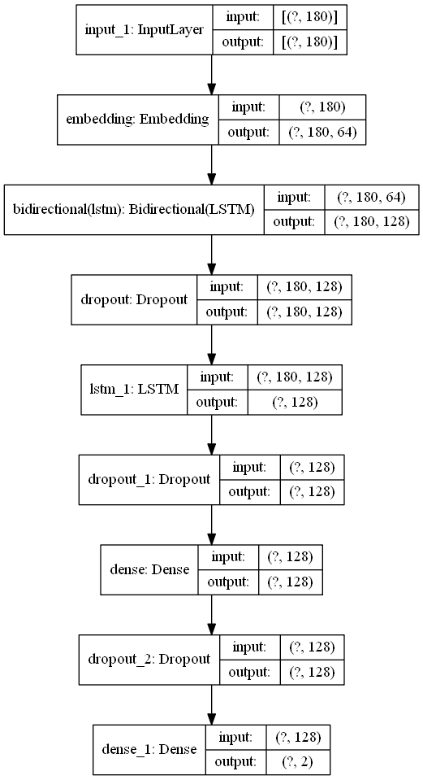
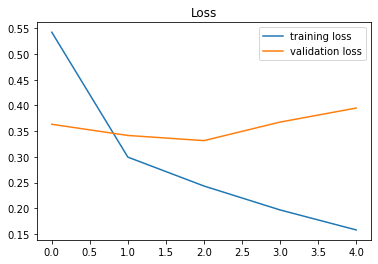
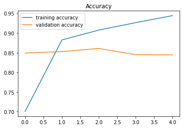
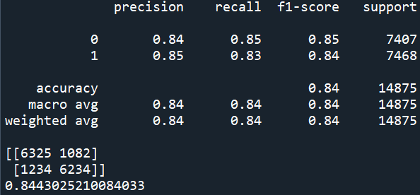

# Predictive classification model using Natural Language Processing (NLP) for IMDB movie rating.
 Using deep learning model to train over 49,000 IMDB rating dataset to categorize either the review is positive and negative.

## Description
1. The project's objective is to categorize the IMDB movies rating. 
2. The IMDB movie reviews contain enormous amount of data, which can be used to predict either the movie review is a negative or positive review. 
3. The dataset contain anomalies such as HTML tags (removed using RegEx), lowercase/uppercase, and duplicates data.
4. The method used for the deep learning model are word embedding, LSTM and Bidirectional.
5. Several method can be used to improve the model such as lemmatization, stemming, CNN, n-grams, etc.

### Deep learning model images

## Results
Training loss & Validation loss:

Training accuracy & Validation accuracy:

Model score:

## Discussion
1. The model achieved 84% accuracy during training. 
2. Both recall and f1 score report 85%. 
3. However, the model starts to overfit after 2nd epochs. Early stopping can be used to prevent overfitting. The dropout data can be increased to control overfitting.

## Credits:
Shout out to Ankit152 for the IMDB Dataset. Check out the dataset by clicking the link below. :smile:
### Dataset link
[IMDB-Sentiment-Analysis](https://github.com/Ankit152/IMDB-sentiment-analysis)
